# GoldOS Database Schema (Phase 2)

Production PostgreSQL schema for multi-tenant jewelry/gold ERP SaaS.

## Statistics

| Metric                  |  Count |
| ----------------------- | -----: |
| **Tables (models)**     |     66 |
| **Enums**               |     55 |
| **Relation fields**     |    121 |
| **Schema files**        |     14 |
| **Migration SQL lines** | ~2,485 |

## Schema Files

| File                   | Domain                                                       |
| ---------------------- | ------------------------------------------------------------ |
| `schema.prisma`        | Generator and datasource                                     |
| `enums.prisma`         | All enum definitions                                         |
| `tenancy.prisma`       | Tenant, Organization, Plan, Subscription, Settings           |
| `auth.prisma`          | User, Role, Permission, Session, ApiKey, Device              |
| `geo.prisma`           | Country, City, Address                                       |
| `organization.prisma`  | Branch, Employee, Workshop                                   |
| `partners.prisma`      | Customer, Supplier, Manufacturer                             |
| `catalog.prisma`       | Category, Brand, Product, GoldItem, DiamondItem, Gemstone    |
| `inventory.prisma`     | InventoryItem, Lot, StockMovement, Transfer, Reservation     |
| `orders.prisma`        | PurchaseOrder, SalesOrder and line items                     |
| `billing.prisma`       | Invoice, InvoiceItem, Payment, Expense                       |
| `finance.prisma`       | Bank, CashRegister, Transaction, Currency, Pricing, Tax      |
| `manufacturing.prisma` | ManufacturingOrder, RepairOrder, Certificate                 |
| `system.prisma`        | File, Media, Attachment, Audit, Webhook, Integration, Backup |
| `ai.prisma`            | AiConversation, AiReport                                     |

## Design Principles

- UUID primary keys on every table
- Soft delete via `deletedAt` on every table
- Timestamps `createdAt` and `updatedAt` on every table
- `tenantId` on all tenant-scoped tables with FK to `tenants`
- Restrict on core business FKs; Cascade on line items and settings
- Money as `Decimal(18,4)`; weight as `Decimal(12,4)`
- Snake_case column mapping via `@map`

## Entity Relationship Diagram

```mermaid
erDiagram
    Tenant ||--o{ Organization : has
    Tenant ||--o{ Subscription : has
    Plan ||--o{ Subscription : offers
    Tenant ||--o{ Branch : operates
    Organization ||--o{ Branch : owns
    Tenant ||--o{ User : employs
    Role ||--o{ User : assigns
    Role ||--o{ RolePermission : grants
    Permission ||--o{ RolePermission : includes
    User ||--o{ UserBranch : accesses
    Branch ||--o{ UserBranch : scopes
    Branch ||--o{ InventoryItem : stocks
    Product ||--o{ InventoryItem : instantiates
    Product ||--o| GoldItem : extends
    Product ||--o| DiamondItem : extends
    Product ||--o| Gemstone : extends
    Category ||--o{ Product : classifies
    Brand ||--o{ Product : brands
    Manufacturer ||--o{ Product : makes
    Customer ||--o{ SalesOrder : places
    Customer ||--o{ Invoice : receives
    SalesOrder ||--o{ Invoice : bills
    Invoice ||--o{ InvoiceItem : contains
    Invoice ||--o{ Payment : settles
    Supplier ||--o{ PurchaseOrder : supplies
    PurchaseOrder ||--o{ PurchaseOrderLine : lines
    Branch ||--o{ Transfer : ships
    Transfer ||--o{ TransferLine : items
    InventoryItem ||--o{ StockMovement : tracks
    Customer ||--o{ Reservation : holds
    Branch ||--o{ CashRegister : operates
    Bank ||--o{ Transaction : records
    CashRegister ||--o{ Transaction : records
    Workshop ||--o{ ManufacturingOrder : produces
    Workshop ||--o{ RepairOrder : repairs
    Tenant ||--o{ GoldPriceHistory : tracks
    Tenant ||--o{ PricingRule : configures
    Tenant ||--o{ TaxRule : applies
    Tenant ||--o{ AuditLog : audits
    Tenant ||--o{ Integration : connects
    Tenant ||--o{ Webhook : notifies
    Tenant ||--o{ AiConversation : chats
    AiConversation ||--o{ AiReport : generates
    Country ||--o{ City : contains
    File ||--o{ Media : serves
    File ||--o{ Attachment : attaches

    Tenant {
        uuid id PK
        string slug UK
        TenantStatus status
        timestamptz deleted_at
    }

    Organization {
        uuid id PK
        uuid tenant_id FK
        string code UK
        OrganizationStatus status
    }

    Product {
        uuid id PK
        uuid tenant_id FK
        string sku UK
        ProductType type
    }

    InventoryItem {
        uuid id PK
        uuid tenant_id FK
        uuid branch_id FK
        string serial_number UK
        InventoryStatus status
    }

    Invoice {
        uuid id PK
        uuid tenant_id FK
        string invoice_no UK
        InvoiceStatus status
        decimal total_amount
    }
```



## Table Index

### Tenancy and Billing

`tenants`, `organizations`, `plans`, `subscriptions`, `tenant_settings`, `system_settings`

### Auth and Access

`users`, `roles`, `permissions`, `role_permissions`, `user_branches`, `sessions`, `api_keys`, `devices`

### Geography

`countries`, `cities`, `addresses`

### Organization

`branches`, `employees`, `workshops`

### Partners

`customers`, `suppliers`, `manufacturers`

### Catalog

`categories`, `brands`, `products`, `gold_items`, `diamond_items`, `gemstones`

### Inventory

`inventory_items`, `inventory_lots`, `stock_movements`, `transfers`, `transfer_lines`, `reservations`

### Orders

`purchase_orders`, `purchase_order_lines`, `sales_orders`, `sales_order_lines`

### Billing

`invoices`, `invoice_items`, `payments`, `expenses`

### Finance

`currencies`, `exchange_rates`, `gold_price_history`, `pricing_rules`, `tax_rules`, `banks`, `cash_registers`, `transactions`

### Manufacturing

`manufacturing_orders`, `repair_orders`, `certificates`

### System

`files`, `media`, `attachments`, `notifications`, `audit_logs`, `activity_logs`, `webhooks`, `integrations`, `backups`, `settings`

### AI

`ai_conversations`, `ai_reports`

## Commands

```bash
pnpm --filter @goldos/database db:format
pnpm --filter @goldos/database db:validate
pnpm --filter @goldos/database db:generate
pnpm --filter @goldos/database db:migrate
pnpm --filter @goldos/database db:seed
```

## Migration

`prisma/migrations/20260710100000_phase2_complete_schema/migration.sql`
